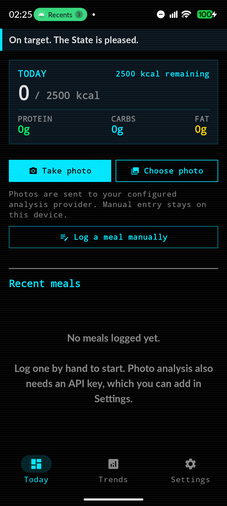
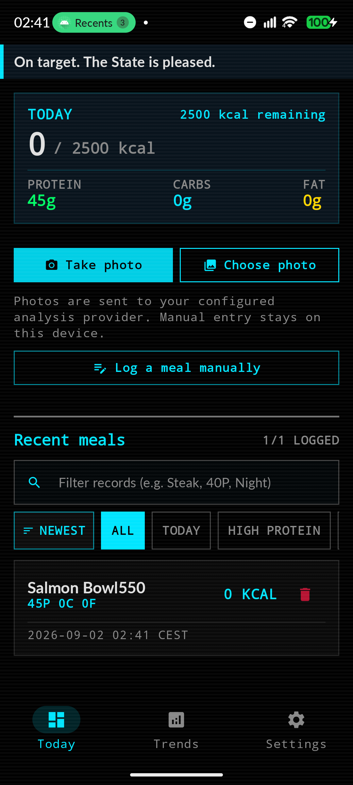
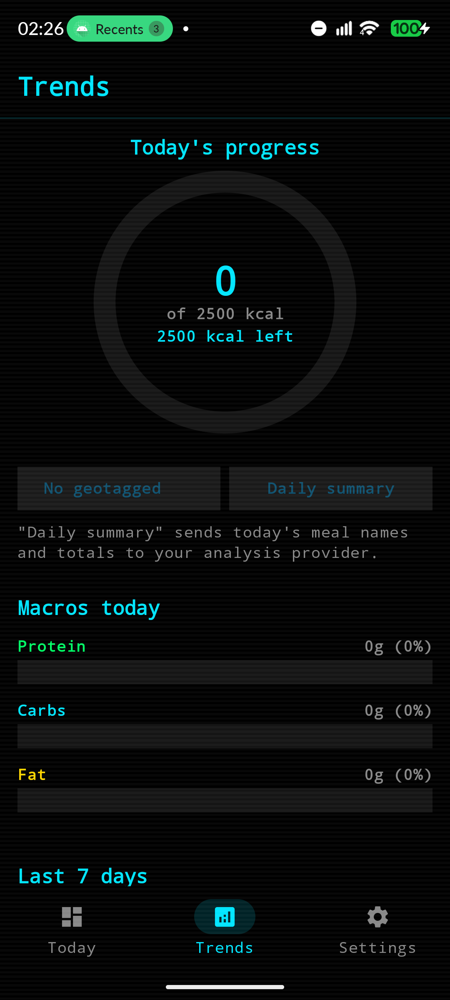
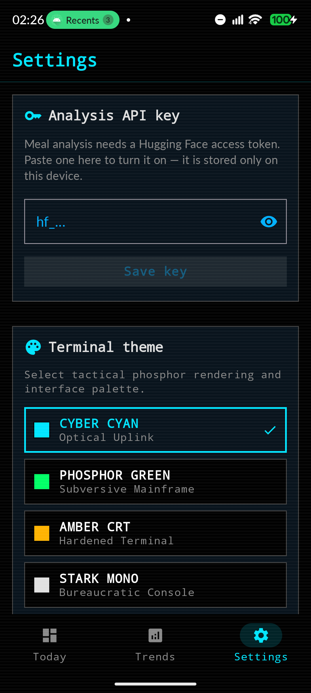

# MacroMandate

A local-first Android calorie and macro tracker with a retro tactical terminal interface. It estimates nutritional values from meal photos using a vision model, lets you log or correct entries by hand, and keeps your data stored locally on your device.

<p align="center">
  
  
  
  
</p>

## What it does

- **Meal photo estimation**: Snap or pick a picture to get an estimate of calories, protein, carbs, and fat. Every result is presented in a review sheet before anything is saved.
- **Manual logging & editing**: Log meals manually without needing an API key or internet connection, and edit any logged meal's name, calories, macros, or beverage status at any time.
- **Daily progress & targets**: Track calories against a daily target with remaining calorie calculations and macro progress bars.
- **Weekly trends**: View seven-day consumption charts, macro distribution breakdown, and weekly summaries.
- **Optional geotagging**: Disabled by default. When enabled, location coordinates are saved alongside meals and rendered as an overlay on uploaded images.
- **Terminal themes**: Switch between Cyber Cyan, Phosphor Green, Amber CRT, and Stark Mono themes.
- **Data export & restore**: Export your history as JSON backups or CSV files for spreadsheets, and restore from backup anytime.
- **Home screen widget**: Quick glance at today's calorie totals directly from your launcher.
- **Reminders**: Optional notifications scheduled via WorkManager if nothing has been logged for a while.

> **Note**: MacroMandate is a personal tracking tool and is not medical software. Nutritional estimates from AI models are approximations and should always be reviewed.

## How photo analysis works

When you take or pick a meal photo:
1. The image is downsampled and corrected for EXIF orientation.
2. The image is sent to an OpenAI-compatible vision endpoint (by default, Hugging Face router running `google/gemma-4-31B-it`, configurable via Settings or build properties).
3. The model returns estimated calories, protein, carbohydrates, and fat.
4. An **Analysis Review Sheet** pops up with the parsed numbers. You can adjust any values or discard the estimate entirely before saving.

## Privacy & data handling

- **Local-first storage**: Meals and audit records live in an on-device Room database. No third-party accounts, analytics, or sync servers are run for this project.
- **Network calls**: Network requests are only made when you trigger photo analysis or generate a daily summary. Only the photo and meal text for that specific request are transmitted.
- **API key storage**: Your API token is saved in app-private DataStore preferences protected by standard Android application sandboxing. The app excludes credentials from logs, backups, and exports.
- **Geotagging disclosure**: If enabled, location coordinates are included with meal records and visible in photo overlays. You can toggle this off in Settings at any time.

## Tech stack

- **Language & UI**: Kotlin 2.1, Jetpack Compose, Material 3
- **Architecture**: MVVM with Repository pattern, StateFlow, Coroutines
- **Storage**: Room Database (with explicit migrations), DataStore Preferences
- **Camera & Images**: CameraX, Coil
- **Networking**: Retrofit 2, OkHttp (OpenAI-compatible chat completions)
- **Background tasks**: WorkManager
- **Widget**: Jetpack Glance

## Getting started

### Prerequisites
- Android Studio Ladybug or newer
- JDK 17+
- Android SDK 37 (`minSdk` 29)

### Build & Run
```bash
git clone https://github.com/shareef01/MacroMandate.git
cd MacroMandate

# Run unit tests
./gradlew test

# Assemble debug APK
./gradlew assembleDebug
```

### API Configuration
To use image analysis:
1. Open the app and navigate to **Settings**.
2. Enter your Hugging Face API token under **Analysis API Key**.

For local development, you can optionally set defaults in `local.properties`:
```properties
HUGGINGFACE_API_KEY=your_token_here
MANDATE_API_BASE_URL=https://router.huggingface.co/
MANDATE_MODEL_ID=google/gemma-4-31B-it
```
*(Note: Release builds disallow compiled-in API keys in `local.properties` by default to prevent accidental credential leakage.)*

## Tests & Verification

Run the test suite:
```bash
# Unit tests
./gradlew test

# Static analysis
./gradlew lintDebug

# Instrumented tests (requires connected device/emulator)
./gradlew connectedDebugAndroidTest
```

## Documentation

- [`docs/AUDIT_REPORT.md`](docs/AUDIT_REPORT.md): Comprehensive security, privacy, and architecture review.
- [`docs/PRIVACY_THREAT_MODEL.md`](docs/PRIVACY_THREAT_MODEL.md): Threat model, data inventory, and network boundary analysis.
- [`docs/PLAY_RELEASE_CHECKLIST.md`](docs/PLAY_RELEASE_CHECKLIST.md): Pre-flight checklist for store release.
- [`RELEASE_GUIDE.md`](RELEASE_GUIDE.md): Keystore setup, signing configuration, and build commands.

## Author

Shareef — [@shareef01](https://github.com/shareef01)

## License

All rights reserved.
